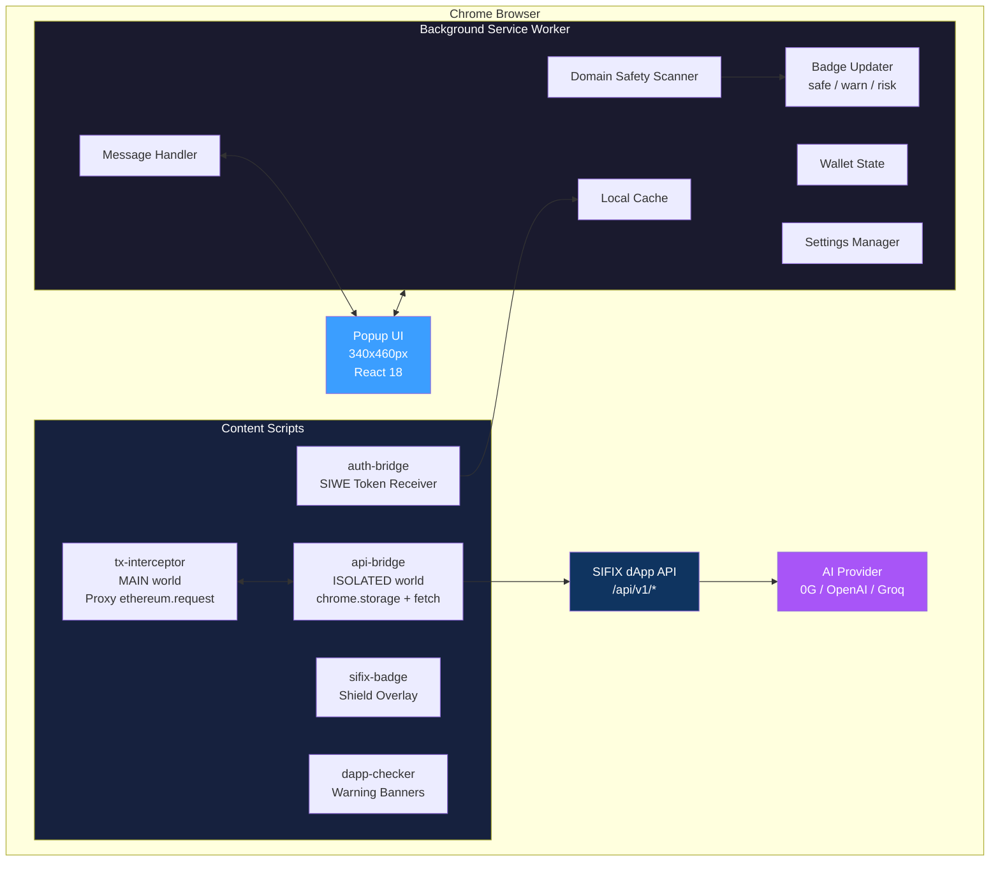
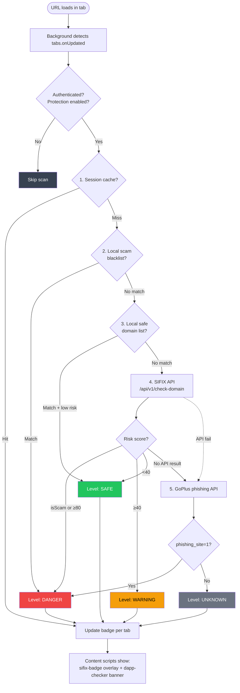
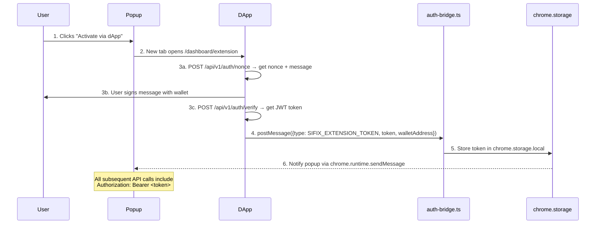

<p align="center">
  
  
  
  
  
</p>

<h1 align="center">🛡️ SIFIX Extension — AI-Powered Wallet Security</h1>

<p align="center">
  <strong>Browser extension component of <a href="https://github.com/sifix-ai">SIFIX</a></strong><br/>
  Intercept-first security layer that simulates and analyzes blockchain transactions <em>before</em> they reach your wallet.<br/>
  Built by <a href="https://mula.labs">Mula Labs</a> · Powered by <a href="https://0g.ai">0G</a> Compute + Storage
</p>

---

## Latest Progress (May 2026)

- Aligned extension API usage with latest dApp routes (no legacy `/extension/*` path assumptions).
- Fixed transaction/tag/domain endpoint mapping to current dApp API surface.
- Improved signature interception for `personal_sign`, `eth_sign`, and `eth_signTypedData*` payload extraction.
- Prepared for prediction-review and action-protection demo flow backed by latest analytics dashboard.
- Extension auth and API usage remain aligned with strict dApp auth gating and live system status checks.

## ✨ Key Features

- **🔄 Auto Transaction Interception** — Hooks `window.ethereum.request()` before MetaMask processes the request, routing transactions through AI-powered risk analysis
- **🌐 Auto Domain Safety Scanning** — Every page load triggers a multi-layer domain safety check (cached per session) with real-time badge updates
- **🤖 AI Simulation & Analysis** — Transaction data is sent to the SIFIX dApp API where an AI agent (0G Compute, OpenAI, Groq, or Ollama) simulates execution and returns a risk assessment
- **🏷️ Community Tags** — View, submit, and vote on address tags (scammer, suspicious, verified, bot, personal) to build a crowdsourced threat database
- **📍 Address & Domain Scanner** — Scan any address, ENS name, or domain for risk scores and threat reports via the SIFIX API
- **💾 Local TX History** — IndexedDB-backed (Dexie) history of all intercepted transactions with risk scores, status, and metadata
- **🛡️ Floating Shield Badge** — On-page overlay showing real-time safety status (SAFE / WARN / RISK / ACTIVE / PAUSED)
- **⚠️ Warning Banners** — Overlay banners on dangerous or suspicious dApp pages
- **🔐 SIWE Authentication** — Sign-In with Ethereum flow for secure extension ↔ dApp communication
- **⚙️ Configurable** — Toggle TX protection, auto-block, notifications, and API endpoint from settings

---

## 🏗️ Architecture



<details>
<summary>📐 ASCII Version</summary>

```
┌──────────────────────────────────────────────────────────────────┐
│                        Chrome Browser                            │
│                                                                  │
│  ┌─────────────────────────────────────────────────────────┐     │
│  │                  Background Service Worker               │     │
│  │                                                         │     │
│  │  ┌──────────┐  ┌──────────────┐  ┌──────────────────┐  │     │
│  │  │ Domain   │  │   Message    │  │    Badge          │  │     │
│  │  │ Safety   │  │   Handler    │  │    Updater        │  │     │
│  │  │ Scanner  │  │              │  │  (safe/warn/risk) │  │     │
│  │  └────┬─────┘  └──────┬───────┘  └──────────────────┘  │     │
│  │       │               │                                │     │
│  │  ┌────┴─────┐   ┌─────┴──────┐   ┌────────────────┐   │     │
│  │  │ Local    │   │  Wallet    │   │  Settings      │   │     │
│  │  │ Cache    │   │  State     │   │  Manager       │   │     │
│  │  └──────────┘   └────────────┘   └────────────────┘   │     │
│  └─────────────────────────────────────────────────────────┘     │
│         │                    ▲                    │               │
│         │ chrome.runtime     │ postMessage        │ fetch          │
│         ▼                    │                    ▼               │
│  ┌─────────────────────────────────────────────────────────┐     │
│  │                    Content Scripts                      │     │
│  │                                                         │     │
│  │  ┌─────────────────┐    ┌──────────────────────────┐   │     │
│  │  │ tx-interceptor  │◄──►│  api-bridge              │   │     │
│  │  │ (MAIN world)    │    │  (ISOLATED world)        │   │     │
│  │  │ Proxy around    │    │  chrome.storage + fetch  │   │     │
│  │  │ ethereum.req()  │    │  Bridge MAIN ↔ API      │   │     │
│  │  └─────────────────┘    └──────────────────────────┘   │     │
│  │                                                         │     │
│  │  ┌──────────────┐  ┌──────────────┐  ┌─────────────┐   │     │
│  │  │ sifix-badge  │  │ dapp-checker │  │ auth-bridge │   │     │
│  │  │ (overlay)    │  │ (banners)    │  │ (SIWE flow) │   │     │
│  │  └──────────────┘  └──────────────┘  └─────────────┘   │     │
│  └─────────────────────────────────────────────────────────┘     │
│         │                                                       │
│         ▼                                                       │
│  ┌─────────────────┐                          ┌──────────────┐   │
│  │   Popup (UI)    │                          │  SIFIX dApp  │   │
│  │   340×460px     │                          │  API Server  │   │
│  │   React 18      │◄──── Bearer Auth ──────►│              │   │
│  │   TailwindCSS   │                          │  /api/v1/*   │   │
│  └─────────────────┘                          └──────┬───────┘   │
│                                                       │          │
│                                                       ▼          │
│                                               ┌──────────────┐   │
│                                               │  AI Provider │   │
│                                               │  (0G/OpenAI/ │   │
│                                               │   Groq/Local)│   │
│                                               └──────────────┘   │
└──────────────────────────────────────────────────────────────────┘
```
</details>

---

## 📁 Project Structure

```
sifix-extension/
├── src/
│   ├── background/
│   │   └── index.ts              # Service worker: domain scan, message handler, badge
│   ├── contents/
│   │   ├── tx-interceptor.ts     # MAIN world: Proxy around window.ethereum.request()
│   │   ├── api-bridge.ts         # ISOLATED world: bridges MAIN ↔ dApp API
│   │   ├── sifix-badge.tsx       # Floating shield badge overlay (React)
│   │   ├── dapp-checker.ts       # Warning banners for risky domains
│   │   └── auth-bridge.ts        # SIWE auth: receives token from dApp
│   ├── components/
│   │   ├── ConnectScreen.tsx     # Disconnected state → dApp activation CTA
│   │   ├── Header.tsx            # Nav bar with panel tabs
│   │   ├── PageSafety.tsx        # Domain safety status card
│   │   ├── RiskScore.tsx         # Risk score display with progress bar
│   │   ├── ScanPanel.tsx         # Address / domain / ENS scanner
│   │   ├── SettingsPanel.tsx     # Protection toggles + API URL config
│   │   ├── StatsCard.tsx         # TX stats grid (total/approved/blocked/simulated)
│   │   ├── TagPanel.tsx          # Community tagging (submit + view + vote)
│   │   ├── TransactionList.tsx   # Local TX history list
│   │   └── WalletStatus.tsx      # Wallet connection status card
│   ├── hooks/
│   │   ├── useWallet.ts          # Wallet state management
│   │   ├── usePageStatus.ts      # Current page safety status
│   │   └── useTransactions.ts    # Local TX history + stats
│   ├── lib/
│   │   ├── api-client.ts         # Authenticated API client (SIWE + Bearer)
│   │   ├── db.ts                 # Dexie/IndexedDB: transactions + tags
│   │   └── messaging.ts          # Type-safe chrome.runtime messaging
│   ├── utils/
│   │   ├── cn.ts                 # clsx + tailwind-merge utility
│   │   ├── detect-dapp.ts        # dApp URL detection heuristic
│   │   └── format.ts             # Address, hash, timestamp, ETH formatters
│   ├── types/
│   │   ├── index.ts              # Shared TypeScript interfaces
│   │   └── ethereum.d.ts         # window.ethereum type declarations
│   ├── constants/
│   │   └── index.ts              # Message types, risk colors, chain IDs, blacklists
│   ├── popup.tsx                 # Entry point: 340×460 popup UI
│   └── style.css                 # Tailwind base + glassmorphic utilities
├── static/
│   └── tx-interceptor.js         # Pre-compiled IIFE for early injection via scripting API
├── build/
│   └── chrome-mv3-prod/          # Production build output
├── package.json
├── tsconfig.json
├── tailwind.config.js
└── postcss.config.js
```

---

## 🚀 Getting Started

### Prerequisites

- **Node.js** ≥ 18
- **npm** or **pnpm**
- **Chrome** 116+ (Manifest V3 support)
- **MetaMask** or another Web3 wallet extension
- **SIFIX dApp** running locally or deployed (see [sifix-dapp](https://github.com/mula-labs/sifix-dapp))

### Installation

```bash
# Clone the monorepo
git clone https://github.com/mula-labs/sifix-repos.git
cd sifix-repos/sifix-extension

# Install dependencies (includes @sifix/agent via file:../sifix-agent)
npm install
```

### Development

```bash
# Start Plasmo dev server with hot-reload
npm run dev
```

Plasmo will compile the extension and watch for changes. The dev build is output to `build/chrome-mv3-dev/`.

### Production Build

```bash
# Build + copy static tx-interceptor.js
npm run build
```

Output: `build/chrome-mv3-prod/`

The build script runs:
```bash
plasmo build && cp static/tx-interceptor.js build/chrome-mv3-prod/tx-interceptor.js
```

### Package for Distribution

```bash
npm run package
```

---

## 🧩 Loading in Chrome

1. Open Chrome and navigate to `chrome://extensions/`
2. Enable **Developer mode** (toggle in top-right corner)
3. Click **Load unpacked**
4. Select the `build/chrome-mv3-prod/` directory
5. The SIFIX shield icon will appear in your toolbar

For development, load from `build/chrome-mv3-dev/` instead. Plasmo's dev server provides hot-reload — changes to `src/` files will auto-reload the extension.

---

## ⚙️ How It Works

### Domain Safety Flow

Every time a tab loads or navigates, the background service worker automatically scans the domain:



<details>
<summary>📐 ASCII Version</summary>

```
URL loads in tab
      │
      ▼
Background detects tabs.onUpdated (status: "loading")
      │
      ▼
Check: user authenticated? protection enabled?
      │
      ├── No → skip
      │
      ▼ Yes
┌─────────────────────────────────────────────┐
│  1. Session cache lookup                    │
│     └── Hit? → return cached level         │
│                                             │
│  2. Local scam blacklist                   │
│     └── Match? → return DANGER             │
│                                             │
│  3. Local safe domain list                 │
│     └── Match? → note for later            │
│                                             │
│  4. SIFIX API /api/v1/check-domain         │
│     ├── isScam or riskScore ≥ 80 → DANGER  │
│     ├── riskScore ≥ 40 → WARNING           │
│     └── riskScore < 40 → SAFE              │
│                                             │
│  5. GoPlus phishing API (fallback)         │
│     └── phishing_site=1 → DANGER           │
│                                             │
│  6. Default → UNKNOWN                      │
└─────────────────────────────────────────────┘
      │
      ▼
Update badge per tab:
  • SAFE    → no badge, green title
  • WARNING → amber "!" badge
  • DANGER  → red "!" badge
  • UNKNOWN → no badge, default title
      │
      ▼
Content scripts show:
  • dapp-checker.ts → warning banner for danger/warning
  • sifix-badge.tsx → floating shield chip
```
</details>

### Transaction Interception Flow

The extension intercepts Web3 requests **before** they reach MetaMask:

```mermaid
flowchart TD
    START([User triggers TX on dApp<br/>e.g. clicks Swap]) --> TXI[tx-interceptor.js<br/>MAIN world Proxy<br/>around ethereum.request]
    TXI --> ISTX{Is TX or<br/>SIGN method?}
    ISTX -->|No| PASS[Pass through to<br/>original ethereum.request]
    ISTX -->|Yes| POPUP_UI[Show pre-flight popup<br/>Simulate & Analyze /<br/>Proceed to Wallet / Cancel]
    POPUP_UI -->|Cancel| REJECT[Throw error 4001<br/>user rejected]
    POPUP_UI -->|Proceed| PASS
    POPUP_UI -->|Analyze| LOADING[Show loading overlay<br/>0G Security Agent running...]
    LOADING --> BRIDGE[api-bridge.ts<br/>ISOLATED world]
    BRIDGE --> API[POST /api/v1/extension/analyze<br/>{from, to, data, value}]
    API --> RESULT[Return analysis to MAIN world<br/>via postMessage]
    RESULT --> MODAL[Show risk modal:<br/>• Risk level + score 0-100<br/>• AI explanation<br/>• Detected threats<br/>• 0G Storage proof]
    MODAL -->|Block / Cancel| REJECT
    MODAL -->|Proceed| PASS
    PASS --> META([MetaMask processes TX])

    style START fill:#22c55e,color:#fff
    style META fill:#3b9eff,color:#fff
    style REJECT fill:#ef4444,color:#fff
    style API fill:#a855f7,color:#fff
```

<details>
<summary>📐 ASCII Version</summary>

```
User triggers TX on dApp (e.g., clicks "Swap")
      │
      ▼
tx-interceptor.js (MAIN world) — Proxy around window.ethereum.request()
      │
      ├── Method is TX or SIGN? ── No → pass through to original
      │
      ▼ Yes
Show pre-flight popup: [Simulate & Analyze] / [Proceed to Wallet] / [Cancel]
      │
      ├── Cancel → throw error code 4001 (user rejected)
      ├── Proceed → pass through to original ethereum.request()
      │
      ▼ Analyze
Show loading overlay ("0G Security Agent running simulation")
      │
      ▼
api-bridge.ts (ISOLATED world):
  1. Check chrome.storage for Bearer token + protection enabled
  2. POST /api/v1/extension/analyze with { from, to, data, value }
  3. Return analysis result to MAIN world via postMessage
      │
      ▼
Show risk modal with:
  • Risk level + score (0–100)
  • AI explanation
  • Detected threats
  • TX details (from, to, value, method)
  • 0G Storage proof (if available)
      │
      ├── Block / Cancel → throw error code 4001
      └── Proceed → pass through to original ethereum.request()
```
</details>

**Intercepted methods:**
- `eth_sendTransaction`
- `eth_signTransaction`
- `eth_sendRawTransaction`
- `wallet_sendCalls`
- `personal_sign`
- `eth_sign`
- `eth_signTypedData` / `v3` / `v4`
- `eth_getEncryptionPublicKey`
- `eth_decrypt`

**Early injection:** The `static/tx-interceptor.js` file is injected at `webNavigation.onBeforeNavigate` via `chrome.scripting.executeScript` with `injectImmediately: true` and `world: "MAIN"` to ensure the proxy is in place **before** any page scripts run.

### Authentication Flow

The extension authenticates with the SIFIX dApp via SIWE (Sign-In with Ethereum):



<details>
<summary>📐 ASCII Version</summary>

```
1. User clicks "Activate via dApp" in popup
      │
      ▼
2. New tab opens to dApp dashboard (/dashboard/extension)
      │
      ▼
3. dApp performs SIWE flow:
   a. POST /api/v1/auth/nonce → get nonce + message
   b. User signs message with wallet
   c. POST /api/v1/auth/verify → get JWT token
      │
      ▼
4. dApp sends token via postMessage:
   window.postMessage({ type: 'SIFIX_EXTENSION_TOKEN', token, walletAddress })
      │
      ▼
5. auth-bridge.ts (content script) receives token
   → Stores in chrome.storage.local
   → Notifies popup via chrome.runtime.sendMessage
      │
      ▼
6. All subsequent API calls include: Authorization: Bearer <token>
```
</details>

---

## 🔌 API Connection

The extension communicates with the SIFIX dApp API for all analysis and scanning operations.

### Default Endpoint

```
http://localhost:3000/api/v1
```

Configurable via **Settings → dApp API URL** in the extension popup.

### API Endpoints Used

**Authentication:**
- `GET /api/v1/auth/nonce?walletAddress=0x...` — Get SIWE nonce
- `POST /api/v1/auth/verify` — Verify signature, receive JWT
- `GET /api/v1/auth/verify-token` — Check if token is valid

**Analysis (Bearer token required):**
- `POST /api/v1/extension/analyze` — Analyze a transaction
- `POST /api/v1/extension/scan` — Scan an address
- `GET /api/v1/extension/settings` — Get AI provider settings

**Domain Safety:**
- `GET /api/v1/check-domain?domain=example.com` — Domain risk check
- `GET /api/v1/scan/{domain}` — Full domain scan

**Community Tags:**
- `GET /api/v1/address-tags?address=0x...` — Get tags for address
- `POST /api/v1/address-tags` — Submit a new tag
- `POST /api/v1/address/{address}/tags/{tagId}/vote` — Vote on tag

**Stats:**
- `GET /api/v1/stats` — Platform-wide statistics

### AI Provider Architecture

The extension does **not** call AI providers directly. All AI operations are proxied through the dApp API:

```
Extension → dApp API → AI Provider (0G Compute / OpenAI / Groq / Ollama / Custom)
```

AI provider configuration is managed in the dApp dashboard settings page, not in the extension.

---

## ⚙️ Configuration

### Extension Settings

Stored in `chrome.storage.local` and accessible via the popup:

**Protection Enabled** — Toggle TX interception on/off (default: `true`)
**Auto-Block High Risk** — Automatically block HIGH/CRITICAL transactions (default: `false`)
**Notifications** — Show browser notifications for blocked TXs (default: `true`)
**dApp API URL** — Backend API endpoint (default: `http://localhost:3000/api/v1`)

### Environment Variables

Plasmo supports environment variables via `.env` files:

```env
PLASMO_PUBLIC_DAPP_API_URL=http://localhost:3000/api/v1
PLASMO_PUBLIC_DAPP_EXTENSION_URL=http://localhost:3000/dashboard/extension
```

### Chain Constants

| Chain ID | Network                  |
|----------|--------------------------|
| 1        | Ethereum Mainnet         |
| 11155111 | Sepolia Testnet          |
| 8453     | Base                     |
| 137      | Polygon                  |
| 42161    | Arbitrum One             |
| 10       | Optimism                 |
| 16600    | 0G Galileo Testnet       |
| 16601    | 0G Galileo Mainnet       |
| 16602    | 0G Galileo Testnet (current) |

---

## 🔑 Permissions

The extension requires the following Chrome permissions:

**Required permissions:**
- `storage` — Persist wallet state, auth token, settings
- `tabs` — Detect active tab URL for domain scanning
- `activeTab` — Access current tab for wallet connection
- `scripting` — Inject tx-interceptor.js into page MAIN world
- `webNavigation` — Early script injection on navigation events

**Host permissions:**
- `http://*/*` — API calls to dApp backend + GoPlus phishing API
- `https://*/*` — Same as above for HTTPS endpoints

---

## 🛠️ Tech Stack

| Technology     | Version | Purpose                          |
|----------------|---------|----------------------------------|
| Plasmo         | 0.88    | Chrome extension framework (MV3) |
| React          | 18.3    | Popup + content script UIs       |
| TypeScript     | 5.4     | Type safety                      |
| TailwindCSS    | 3.4     | Styling (glassmorphic dark theme)|
| Dexie          | 4.0     | IndexedDB wrapper (local TX history) |
| @sifix/agent   | local   | SIFIX AI agent SDK               |
| viem           | 2.9     | Ethereum utilities               |

---

## 🧪 Troubleshooting

### Extension doesn't intercept transactions

- **Ensure MetaMask is installed** and the page has `window.ethereum` available
- Check browser console for `[SIFIX] ✅ Transaction interceptor active`
- If MetaMask injects after page load, the extension polls for 30 seconds waiting for the provider
- Try reloading the page — the interceptor is re-injected on every navigation

### "Bridge not ready" error

- The api-bridge content script must be active for TX analysis to work
- Reload the page and check that no ad-blockers are blocking content scripts
- Ensure the extension has host permissions for the current site

### Domain safety shows "Unknown" for known sites

- Check that you're authenticated (popup shows connected state)
- Verify protection is enabled in settings
- Ensure the SIFIX dApp API is accessible at the configured URL

### Auth token not received from dApp

- Verify the dApp is running and accessible
- Check that `auth-bridge.ts` matches your dApp URL (defaults to `localhost` and `*.vercel.app`)
- You can manually paste a token via the "Paste token manually" option in the connect screen

### Badge or overlays not appearing

- Content scripts only activate on `http`/`https` URLs (not `chrome://` pages)
- The floating badge only shows on detected dApp pages when authenticated
- dApp detection is based on URL patterns (known domains, path keywords, subdomain prefixes)

### Build errors

- Ensure `@sifix/agent` is available at `../sifix-agent` (file dependency)
- Run `npm install` from the extension directory
- Delete `.plasmo/` and `node_modules/.cache/` if stale builds occur

---

## 📄 License

This project is licensed under the **MIT License**.

```
MIT License

Copyright (c) 2024–2026 Mula Labs

Permission is hereby granted, free of charge, to any person obtaining a copy
of this software and associated documentation files (the "Software"), to deal
in the Software without restriction, including without limitation the rights
to use, copy, modify, merge, publish, distribute, sublicense, and/or sell
copies of the Software, and to permit persons to whom the Software is
furnished to do so, subject to the following conditions:

The above copyright notice and this permission notice shall be included in all
copies or substantial portions of the Software.

THE SOFTWARE IS PROVIDED "AS IS", WITHOUT WARRANTY OF ANY KIND, EXPRESS OR
IMPLIED, INCLUDING BUT NOT LIMITED TO THE WARRANTIES OF MERCHANTABILITY,
FITNESS FOR A PARTICULAR PURPOSE AND NONINFRINGEMENT. IN NO EVENT SHALL THE
AUTHORS OR COPYRIGHT HOLDERS BE LIABLE FOR ANY CLAIM, DAMAGES OR OTHER
LIABILITY, WHETHER IN AN ACTION OF CONTRACT, TORT OR OTHERWISE, ARISING FROM,
OUT OF OR IN CONNECTION WITH THE SOFTWARE OR THE USE OR OTHER DEALINGS IN THE
SOFTWARE.
```

---

<p align="center">
  Built with 🛡️ by <a href="https://mula.labs"><strong>Mula Labs</strong></a> · Powered by <a href="https://0g.ai"><strong>0G</strong></a><br/>
  <sub>SIFIX — Protecting wallets before the transaction hits the chain.</sub>
</p>
